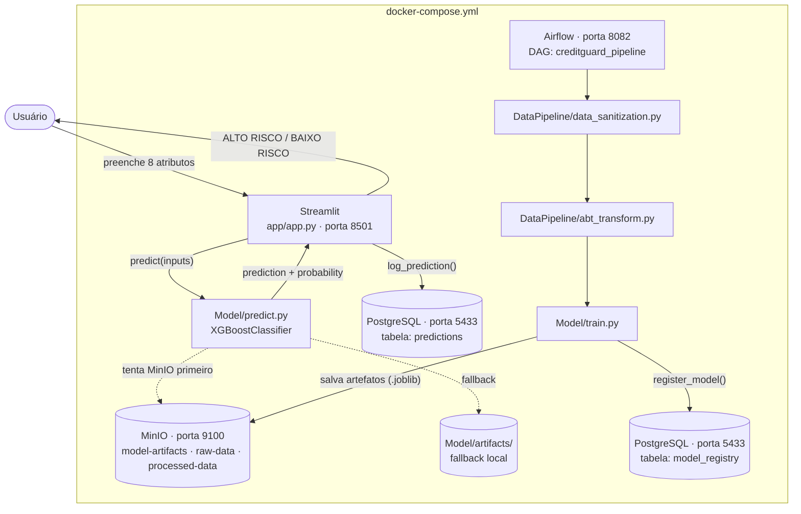

# MLOps — CreditGuard AI

Documentação da infraestrutura MLOps implementada no projeto ProScore Analytics — CreditGuard AI.

---

## Visão Geral

A camada MLOps do projeto é composta por cinco componentes integrados, orquestrados via `docker-compose.yml` na raiz do projeto:



---

## Componentes Implementados

### 1. Streamlit — Interface de Predição (`app/app.py`)

Interface web que expõe o modelo ao usuário final.

- Porta: `8501`
- Coleta 8 atributos do cliente (renda, crédito, idade, scores externos etc.)
- Chama `Model/predict.py` e exibe o resultado: **ALTO RISCO** ou **BAIXO RISCO** com probabilidade de inadimplência
- Após cada predição, registra o resultado no PostgreSQL via `utils/db.py`
- Lê a versão do modelo da variável de ambiente `MODEL_VERSION`

---

### 2. MinIO — Armazenamento de Artefatos (`utils/storage.py`)

Armazenamento de objetos compatível com S3, usado para versionar artefatos do modelo.

- Console: `http://localhost:9101`
- API: `http://localhost:9100`
- Credenciais padrão: `minioadmin / minioadmin`

**Buckets criados automaticamente pelo `minio-init`:**

| Bucket | Conteúdo |
|---|---|
| `raw-data` | Dataset bruto (application_train.csv) |
| `processed-data` | ABT gerada pelo DataPipeline |
| `model-artifacts` | Modelo serializado e lista de features |

**Artefatos versionados por `MODEL_VERSION` (padrão: `v1`):**

```
model-artifacts/
└── v1/
    ├── xgb_balanced_model.joblib
    └── features.joblib
```

O `predict.py` tenta carregar os artefatos do MinIO primeiro; na ausência de conexão, faz fallback para o sistema de arquivos local (`Model/artifacts/`).

---

### 3. PostgreSQL — Persistência (`utils/db.py`, `infra/init.sql`)

Banco de dados relacional para rastreabilidade de predições e registro de modelos.

- Porta: `5433` (mapeada externamente)
- Banco: `creditguard` (aplicação) + `airflow` (metadados do Airflow)
- Usuário/senha: `creditguard / creditguard`

**Tabela `predictions` — log de predições em produção:**

| Coluna | Tipo | Descrição |
|---|---|---|
| `id` | SERIAL | Identificador único |
| `created_at` | TIMESTAMP | Data/hora da predição |
| `amt_income_total` | FLOAT | Renda informada |
| `amt_credit` | FLOAT | Valor do crédito solicitado |
| `amt_annuity` | FLOAT | Valor da prestação |
| `cnt_children` | INTEGER | Número de filhos |
| `days_birth` | INTEGER | Idade em dias (negativo) |
| `ext_source_1/2/3` | FLOAT | Scores externos |
| `prediction` | INTEGER | 0 = Adimplente, 1 = Inadimplente |
| `probability` | FLOAT | Probabilidade de inadimplência |
| `model_version` | VARCHAR | Versão do modelo utilizada |

**Tabela `model_registry` — registro de versões do modelo:**

| Coluna | Tipo | Descrição |
|---|---|---|
| `version` | VARCHAR | Identificador da versão (ex: `v1`) |
| `roc_auc` | FLOAT | ROC-AUC no conjunto de teste |
| `recall` | FLOAT | Recall no conjunto de teste |
| `precision_score` | FLOAT | Precision no conjunto de teste |
| `f1` | FLOAT | F1-Score no conjunto de teste |
| `accuracy` | FLOAT | Acurácia no conjunto de teste |
| `is_active` | BOOLEAN | Indica se é o modelo em produção |
| `artifact_bucket` | VARCHAR | Bucket MinIO do artefato |
| `artifact_path` | VARCHAR | Caminho do artefato no bucket |

---

### 4. Apache Airflow — Orquestração (`dags/creditguard_pipeline.py`)

Orquestrador do pipeline de dados e treinamento.

- Webserver: `http://localhost:8082` (usuário: `admin` / senha: `admin`)
- Executor: `LocalExecutor`
- Versão: `2.10.0`
- Metadados armazenados no PostgreSQL (`airflow` database)

---

### 5. DAG `creditguard_pipeline`

Pipeline completo de retreinamento, acionado manualmente (`schedule=None`).

```
extract_data → data_sanitization → abt_transform → train_model
```

| Task | Função | Descrição |
|---|---|---|
| `extract_data` | `check_raw_data()` | Valida presença do CSV bruto em `Dados/raw/` |
| `data_sanitization` | `run_sanitization()` | Limpeza e tratamento dos dados brutos |
| `abt_transform` | `run_transform()` | Construção da ABT com encoding e feature engineering |
| `train_model` | `run_training()` | Treina o XGBoost Balanced e salva os artefatos |

---

## Como Subir o Stack Completo

```bash
docker-compose up --build
```

| Serviço | URL |
|---|---|
| Streamlit (app) | http://localhost:8501 |
| Airflow Webserver | http://localhost:8082 |
| MinIO Console | http://localhost:9101 |
| PostgreSQL | localhost:5433 |

---

## Modelo em Produção

| Métrica | Valor |
|---|---|
| Algoritmo | XGBoost com `scale_pos_weight` |
| ROC-AUC | 0.7509 |
| Recall | 0.6568 |
| Gini | 0.5019 |
| KS | 0.3694 |
| Features | 119 (pós-encoding) |
| Versão ativa | v1 |

O Recall é a métrica prioritária: o custo de aprovar um inadimplente supera o custo de negar um bom pagador.

---

## Roadmap de Desenvolvimento MLOps

A evolução da infraestrutura MLOps segue quatro etapas progressivas. As etapas i) e ii) estão implementadas e entregues neste repositório. As etapas iii) e iv) constituem os próximos passos de desenvolvimento.

### i) Containerização e Serving com Docker Compose ✅

Toda a stack de produção é definida em `docker-compose.yml` na raiz do projeto. Um único comando sobe cinco serviços integrados: aplicação Streamlit, MinIO, PostgreSQL, Airflow Webserver e Airflow Scheduler. O modelo é servido em `http://localhost:8501` com fallback local caso o MinIO não esteja disponível.

### ii) Orquestração do Pipeline com Apache Airflow ✅

O pipeline completo de dados e retreinamento é orquestrado pela DAG `creditguard_pipeline` (`dags/creditguard_pipeline.py`), composta por quatro tasks em sequência: `extract_data → data_sanitization → abt_transform → train_model`. A execução manual alternativa é disponibilizada via `MLOps/pipeline_orchestration.py`, que reutiliza os mesmos módulos do Airflow sem depender do daemon.

### iii) API REST para Inferência com FastAPI

**Objetivo:** Expor o modelo como endpoint HTTP independente do Streamlit, habilitando integração com sistemas externos (ERPs, CRMs, aplicativos mobile) sem acoplamento à interface visual.

**Especificação planejada:**

```
POST /predict
Content-Type: application/json

{
  "AMT_INCOME_TOTAL": 150000.0,
  "AMT_CREDIT": 300000.0,
  "AMT_ANNUITY": 25000.0,
  "CNT_CHILDREN": 0,
  "DAYS_BIRTH": -12775,
  "EXT_SOURCE_1": 0.50,
  "EXT_SOURCE_2": 0.50,
  "EXT_SOURCE_3": 0.50
}

→ 200 OK
{
  "prediction": 0,
  "probability": 0.1342,
  "classification": "BAIXO RISCO",
  "model_version": "v1"
}
```

**Stack:** FastAPI + Uvicorn, containerizado na porta `8000`. O endpoint reutiliza `Model/predict.py` sem alterações — o mesmo serviço de inferência já implementado. A API seria adicionada ao `docker-compose.yml` como serviço `creditguard-api` paralelo ao Streamlit.

**Motivação técnica:** Separação de responsabilidades entre interface (Streamlit) e serviço de inferência (API REST), permitindo múltiplos consumidores simultâneos e integração via webhook ou batch.

### iv) Monitoramento de Data Drift e Alertas em Produção

**Objetivo:** Detectar automaticamente quando a distribuição dos dados de entrada em produção diverge da distribuição do dataset de treinamento, sinalizando necessidade de retreinamento antes que a acurácia do modelo degrade.

**Abordagem planejada:**

| Componente | Tecnologia | Função |
|---|---|---|
| Coleta de estatísticas | `utils/db.py` (já existe) | Tabela `predictions` acumula entradas reais em produção |
| Detecção de drift | `scipy.stats.ks_2samp` (KS-test) | Compara distribuição das features de entrada (produção vs. treino) |
| Relatório | Evidently AI | Dashboard HTML com PSI, KS-statistic e distribuições sobrepostas |
| Alertas | DAG Airflow agendada (cron semanal) | Dispara alerta se KS-statistic > 0.1 em qualquer feature crítica |
| Trigger de retreinamento | Airflow + MinIO | Se drift confirmado, executa pipeline completo e registra novo modelo em `model_registry` |

**Features críticas a monitorar** (top 5 por importância de gain):

```
EXT_SOURCE_2, EXT_SOURCE_3, DAYS_BIRTH, AMT_CREDIT, EXT_SOURCE_1_MISSING
```

**Justificativa:** O modelo XGBoost Balanced foi treinado com dados do período do dataset Home Credit. Em produção real, variações macroeconômicas (taxa de juros, desemprego) alteram o perfil de risco dos clientes. O KS-test sobre as features de maior ganho detecta essa deriva antes que o Recall do modelo caia abaixo do limiar aceitável.
