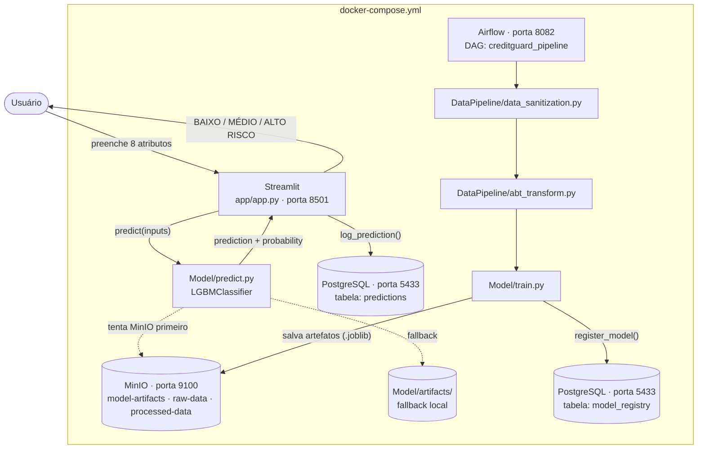
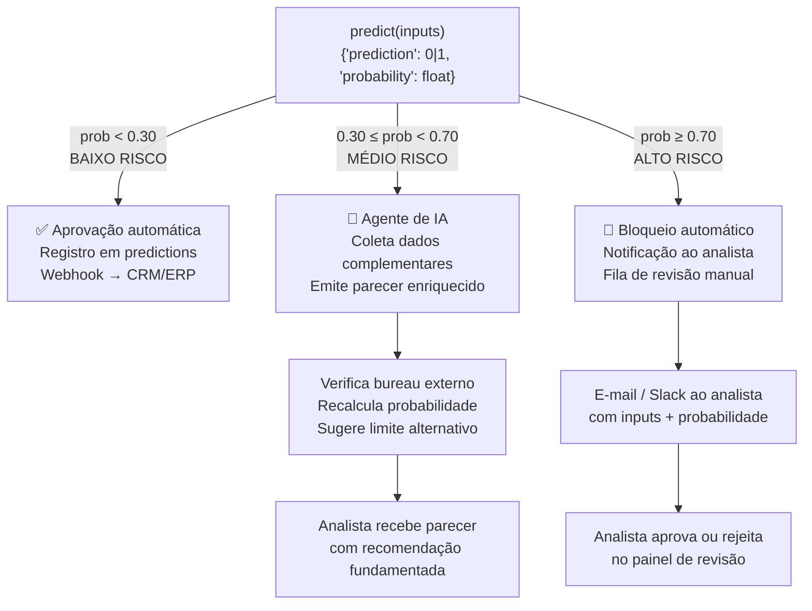

# MLOps — CreditGuard AI

Documentação da infraestrutura MLOps implementada no projeto ProScore Analytics — CreditGuard AI.

---

## Visão Geral

A camada MLOps do projeto é composta por cinco componentes integrados, orquestrados via `docker-compose.yml` (disponível tanto na raiz do projeto quanto em `MLOps/docker-compose.yml`):



---

## Componentes Implementados

### 1. Streamlit — Interface de Predição (`app/app.py`)

Interface web que expõe o modelo ao usuário final.

- Porta: `8501`
- Coleta 8 atributos do cliente (renda, crédito, idade, scores externos etc.)
- Chama `Model/predict.py` e exibe o resultado: **BAIXO RISCO**, **MÉDIO RISCO** ou **ALTO RISCO** com probabilidade de inadimplência
- Após cada predição, registra o resultado no PostgreSQL via `utils/db.py`
- Lê a versão do modelo da variável de ambiente `MODEL_VERSION`

---

### 2. MinIO — Armazenamento de Artefatos (`utils/storage.py`)

Armazenamento de objetos compatível com S3, usado para versionar artefatos do modelo.

- Console: `http://localhost:9101`
- API: `http://localhost:9100`
- Credenciais padrão: `minioadmin / minioadmin`

**Buckets criados automaticamente pelo `minio-init`:**

| Bucket | Conteúdo |
|---|---|
| `raw-data` | Dataset bruto (application_train.csv) |
| `processed-data` | ABT gerada pelo DataPipeline |
| `model-artifacts` | Modelo serializado e lista de features |

**Artefatos versionados por `MODEL_VERSION` (padrão: `v3`):**

```
model-artifacts/
└── v3/
    ├── best_model.joblib
    ├── preprocessor.joblib
    └── features.joblib
```

O `predict.py` tenta carregar os artefatos do MinIO primeiro; na ausência de conexão, faz fallback para o sistema de arquivos local (`Model/artifacts/`).

---

### 3. PostgreSQL — Persistência (`utils/db.py`, `infra/init.sql`)

Banco de dados relacional para rastreabilidade de predições e registro de modelos.

- Porta: `5433` (mapeada externamente)
- Banco: `creditguard` (aplicação) + `airflow` (metadados do Airflow)
- Usuário/senha: `creditguard / creditguard`

**Tabela `predictions` — log de predições em produção:**

| Coluna | Tipo | Descrição |
|---|---|---|
| `id` | SERIAL | Identificador único |
| `created_at` | TIMESTAMP | Data/hora da predição |
| `amt_income_total` | FLOAT | Renda informada |
| `amt_credit` | FLOAT | Valor do crédito solicitado |
| `amt_annuity` | FLOAT | Valor da prestação |
| `cnt_children` | INTEGER | Número de filhos |
| `days_birth` | INTEGER | Idade em dias (negativo) |
| `ext_source_1/2/3` | FLOAT | Scores externos |
| `prediction` | INTEGER | 0 = Adimplente, 1 = Inadimplente |
| `probability` | FLOAT | Probabilidade de inadimplência |
| `model_version` | VARCHAR | Versão do modelo utilizada |

**Tabela `model_registry` — registro de versões do modelo:**

| Coluna | Tipo | Descrição |
|---|---|---|
| `version` | VARCHAR | Identificador da versão (ex: `v1`) |
| `roc_auc` | FLOAT | ROC-AUC no conjunto de teste |
| `recall` | FLOAT | Recall no conjunto de teste |
| `precision_score` | FLOAT | Precision no conjunto de teste |
| `f1` | FLOAT | F1-Score no conjunto de teste |
| `accuracy` | FLOAT | Acurácia no conjunto de teste |
| `is_active` | BOOLEAN | Indica se é o modelo em produção |
| `artifact_bucket` | VARCHAR | Bucket MinIO do artefato |
| `artifact_path` | VARCHAR | Caminho do artefato no bucket |

---

### 4. Apache Airflow — Orquestração (`dags/creditguard_pipeline.py`)

Orquestrador do pipeline de dados e treinamento.

- Webserver: `http://localhost:8082` (usuário: `admin` / senha: `admin`)
- Executor: `LocalExecutor`
- Versão: `2.10.0`
- Metadados armazenados no PostgreSQL (`airflow` database)

---

### 5. DAG `creditguard_pipeline`

Pipeline completo de retreinamento, acionado manualmente (`schedule=None`).

```
extract_data → data_sanitization → abt_transform → train_model
```

| Task | Função | Descrição |
|---|---|---|
| `extract_data` | `check_raw_data()` | Valida presença do CSV bruto em `Dados/raw/` |
| `data_sanitization` | `run_sanitization()` | Limpeza e tratamento dos dados brutos |
| `abt_transform` | `run_transform()` | Construção da ABT com encoding e feature engineering |
| `train_model` | `run_training()` | Treina o LightGBM Balanced e salva os artefatos |

---

## Como Subir o Stack Completo

A partir da **raiz do projeto**:

```bash
docker-compose up --build
```

A partir de **MLOps/**:

```bash
cd MLOps
docker-compose up --build
```

| Serviço | URL |
|---|---|
| Streamlit (app) | http://localhost:8501 |
| Airflow Webserver | http://localhost:8082 |
| MinIO Console | http://localhost:9101 |
| PostgreSQL | localhost:5433 |

---

## Modelo em Produção

| Métrica | Valor |
|---|---|
| Algoritmo | LightGBM com `class_weight="balanced"` |
| ROC-AUC | 0,7778 |
| Recall | 65,82% |
| Precision | 18,90% |
| F1 | 29,37% |
| Features brutas | 185 |
| Features pós-encoding | 309 |
| Versão ativa | v3 |

O Recall é a métrica prioritária: o custo de aprovar um inadimplente supera o custo de negar um bom pagador.

---

## Roadmap de Desenvolvimento MLOps

A evolução da infraestrutura MLOps segue quatro etapas progressivas. As etapas i), ii) e v) estão implementadas e entregues neste repositório. As etapas iii) e iv) incluem a implementação base e o roadmap de evolução.

### i) Containerização e Serving com Docker Compose ✅

Toda a stack de produção é definida em `docker-compose.yml` (raiz) e `MLOps/docker-compose.yml`. Um único comando sobe sete serviços integrados: aplicação Streamlit (`MLOps/app/`), MinIO, PostgreSQL, Airflow Webserver, Airflow Scheduler, minio-init e airflow-init. O modelo é servido em `http://localhost:8501` com fallback local caso o MinIO não esteja disponível.

### ii) Orquestração do Pipeline com Apache Airflow ✅

O pipeline completo de dados e retreinamento é orquestrado pela DAG `creditguard_pipeline` (`dags/creditguard_pipeline.py`), composta por quatro tasks em sequência: `extract_data → data_sanitization → abt_transform → train_model`. A execução manual alternativa é disponibilizada via `MLOps/pipeline_orchestration.py`, que reutiliza os mesmos módulos do Airflow sem depender do daemon.

### iii) API REST para Inferência com FastAPI

**Objetivo:** Expor o modelo como endpoint HTTP independente do Streamlit, habilitando integração com sistemas externos (ERPs, CRMs, aplicativos mobile) sem acoplamento à interface visual.

**Especificação planejada:**

```
POST /predict
Content-Type: application/json

{
  "AMT_INCOME_TOTAL": 150000.0,
  "AMT_CREDIT": 300000.0,
  "AMT_ANNUITY": 25000.0,
  "CNT_CHILDREN": 0,
  "DAYS_BIRTH": -12775,
  "EXT_SOURCE_1": 0.50,
  "EXT_SOURCE_2": 0.50,
  "EXT_SOURCE_3": 0.50
}

→ 200 OK
{
  "prediction": 0,
  "probability": 0.1342,
  "classification": "BAIXO RISCO",
  "model_version": "v1"
}
```

**Stack:** FastAPI + Uvicorn, containerizado na porta `8000`. O endpoint reutiliza `Model/predict.py` sem alterações — o mesmo serviço de inferência já implementado. A API seria adicionada ao `docker-compose.yml` como serviço `creditguard-api` paralelo ao Streamlit.

**Motivação técnica:** Separação de responsabilidades entre interface (Streamlit) e serviço de inferência (API REST), permitindo múltiplos consumidores simultâneos e integração via webhook ou batch.

### iv) Monitoramento de Data Drift e Retreinamento Automático ✅

**Implementado em:** `dags/drift_monitoring_dag.py`

**Objetivo:** Detectar automaticamente quando a distribuição dos dados de entrada em produção diverge da distribuição do dataset de treinamento, sinalizando necessidade de retreinamento antes que a acurácia do modelo degrade.

**Abordagem planejada:**

| Componente | Tecnologia | Função |
|---|---|---|
| Coleta de estatísticas | `utils/db.py` (já existe) | Tabela `predictions` acumula entradas reais em produção |
| Detecção de drift | `scipy.stats.ks_2samp` (KS-test) | Compara distribuição das features de entrada (produção vs. treino) |
| Relatório | Evidently AI | Dashboard HTML com PSI, KS-statistic e distribuições sobrepostas |
| Alertas | DAG Airflow agendada (cron semanal) | Dispara alerta se KS-statistic > 0.1 em qualquer feature crítica |
| Trigger de retreinamento | Airflow + MinIO | Se drift confirmado, executa pipeline completo e registra novo modelo em `model_registry` |

**Features críticas a monitorar** (top 5 por importância de gain):

```
EXT_SOURCE_2, EXT_SOURCE_3, DAYS_BIRTH, AMT_CREDIT, EXT_SOURCE_1_MISSING
```

**Justificativa:** O modelo LightGBM Balanced foi treinado com dados do período do dataset Home Credit. Em produção real, variações macroeconômicas (taxa de juros, desemprego) alteram o perfil de risco dos clientes. O KS-test sobre as features de maior ganho detecta essa deriva antes que o Recall do modelo caia abaixo do limiar aceitável.

---

### v) Ações Automatizadas a partir das Previsões do Modelo ✅

**Implementado em:** `utils/actions.py` + `MLOps/app/app.py`

**Objetivo:** Fechar o ciclo decisório do negócio conectando as saídas do modelo a fluxos automatizados de aprovação, revisão e enriquecimento de análise — integrando Machine Learning, automação de processos e agentes de IA.

---

#### Fluxo de automação por classificação de risco



---

#### Ação 1 — BAIXO RISCO: Aprovação Automática com Notificação ao CRM

**Gatilho:** `probability < 0.30`

**Fluxo:**
1. A predição é registrada na tabela `predictions` (já implementado em `utils/db.py`)
2. Um webhook HTTP é disparado para o CRM/ERP da instituição com o resultado e o ID do cliente
3. O sistema externo libera automaticamente a proposta de crédito sem intervenção humana

**Tecnologia proposta:** `httpx` (cliente HTTP assíncrono) chamado diretamente pelo `app.py` após a predição, ou via DAG Airflow acionada pelo evento de inserção no PostgreSQL.

```python
# Esboço da integração — chamada após predict()
import httpx

def notificar_crm(client_id: str, probability: float, approved: bool):
    httpx.post(
        url=os.environ["CRM_WEBHOOK_URL"],
        json={"client_id": client_id, "probability": probability, "approved": approved},
        timeout=5,
    )
```

---

#### Ação 2 — MÉDIO RISCO: Agente de IA para Análise Complementar

**Gatilho:** `0.30 ≤ probability < 0.70`

**Fluxo:**
1. O resultado intermediário aciona um agente de IA (Claude via Anthropic API ou LangChain)
2. O agente recebe os inputs do cliente + a probabilidade calculada e realiza tarefas complementares:
   - Consulta dados de bureau externo (quando disponível via API)
   - Avalia o perfil de risco com base em critérios regulatórios (Basileia III, resolução CMN 4.966)
   - Gera um parecer em linguagem natural com justificativas e recomendação de limite alternativo
3. O parecer é enviado ao analista de crédito responsável (e-mail ou painel interno)
4. O analista toma a decisão final com informação enriquecida

**Tecnologia proposta:** Anthropic API (`claude-sonnet-4-6`) com prompt estruturado contendo os dados do cliente e as features mais relevantes do modelo.

```python
# Esboço da chamada ao agente de IA
import anthropic

def gerar_parecer_agente(inputs: dict, probability: float) -> str:
    client = anthropic.Anthropic()
    prompt = f"""
    Você é um analista de crédito sênior. Avalie o seguinte perfil:
    - Renda anual: R$ {inputs['AMT_INCOME_TOTAL']:,.0f}
    - Crédito solicitado: R$ {inputs['AMT_CREDIT']:,.0f}
    - Probabilidade de inadimplência (modelo LightGBM): {probability:.1%}
    - Scores externos: EXT_SOURCE_1={inputs.get('EXT_SOURCE_1')}, EXT_SOURCE_2={inputs.get('EXT_SOURCE_2')}, EXT_SOURCE_3={inputs.get('EXT_SOURCE_3')}

    Com base nesses dados, forneça:
    1. Avaliação dos fatores de risco predominantes
    2. Recomendação: aprovar, negar ou sugerir limite alternativo
    3. Justificativa em linguagem adequada para registro regulatório
    """
    message = client.messages.create(
        model="claude-sonnet-4-6",
        max_tokens=512,
        messages=[{"role": "user", "content": prompt}],
    )
    return message.content[0].text
```

---

#### Ação 3 — ALTO RISCO: Bloqueio Automático e Fila de Revisão Manual

**Gatilho:** `probability ≥ 0.70`

**Fluxo:**
1. A proposta de crédito é bloqueada automaticamente — nenhuma aprovação é emitida sem revisão humana
2. Uma notificação é disparada para o analista de crédito responsável (e-mail via SendGrid ou mensagem via Slack API) com:
   - Inputs do cliente
   - Probabilidade de inadimplência
   - Link para o painel de revisão manual
3. O caso entra em uma fila de revisão priorizada por probabilidade descendente
4. O analista registra a decisão final (aprovação com ressalvas ou recusa) no painel, e o resultado é gravado no PostgreSQL

**Tecnologia proposta:** `smtplib` / SendGrid para e-mail; Slack Incoming Webhooks para notificação em canal dedicado.

```python
# Esboço da notificação ao analista
import smtplib
from email.message import EmailMessage

def notificar_analista(probability: float, inputs: dict):
    msg = EmailMessage()
    msg["Subject"] = f"[CreditGuard] ALTO RISCO — {probability:.1%} de inadimplência"
    msg["From"] = os.environ["SMTP_FROM"]
    msg["To"] = os.environ["ANALISTA_EMAIL"]
    msg.set_content(
        f"Cliente com risco elevado detectado.\n"
        f"Probabilidade: {probability:.1%}\n"
        f"Renda: R$ {inputs['AMT_INCOME_TOTAL']:,.0f} | Crédito: R$ {inputs['AMT_CREDIT']:,.0f}\n"
        f"Acesse o painel para revisão: http://localhost:8501"
    )
    with smtplib.SMTP(os.environ["SMTP_HOST"]) as s:
        s.send_message(msg)
```

---

#### Ação 4 — Deriva Detectada: Retreinamento Automático e Substituição do Modelo

**Gatilho:** DAG Airflow semanal detecta KS-statistic > 0.1 em feature crítica

**Fluxo:**
1. A DAG de monitoramento compara a distribuição das features em `predictions` (produção) com a distribuição do treino salva em `Model/artifacts/`
2. Se deriva confirmada: a DAG `creditguard_pipeline` é acionada automaticamente (via Airflow trigger)
3. O novo modelo é avaliado contra o LightGBM v3 atual (ROC-AUC e Recall no conjunto de teste)
4. Se o novo modelo for superior: artefatos são versionados no MinIO (`v4/`), `model_registry` é atualizado com `is_active=True` e a variável de ambiente `MODEL_VERSION` é atualizada
5. O modelo antigo permanece no MinIO para rollback, com `is_active=False`

---

#### Resumo das integrações implementadas

| Classificação | Ação | Tecnologia | Latência | Status |
|---|---|---|---|---|
| BAIXO RISCO | Webhook para CRM/ERP | `httpx` | < 500 ms | ✅ Implementado |
| MÉDIO RISCO | Parecer via agente de IA | Anthropic API (`claude-sonnet-4-6`) | 2–5 s | ✅ Implementado |
| ALTO RISCO | Notificação ao analista | Slack Webhook / SMTP | < 1 s | ✅ Implementado |
| Deriva detectada | Retreinamento automático | Airflow DAG trigger | assíncrono | ✅ Implementado |

Variáveis de ambiente necessárias para ativar as integrações:

| Variável | Ação habilitada |
|---|---|
| `ANTHROPIC_API_KEY` | Agente de IA para MÉDIO RISCO |
| `CRM_WEBHOOK_URL` | Webhook de aprovação para BAIXO RISCO |
| `SLACK_WEBHOOK_URL` | Notificação Slack para ALTO RISCO |
| `SMTP_HOST` + `ANALISTA_EMAIL` | Notificação por e-mail para ALTO RISCO |

Todas as predições são registradas na tabela `predictions` do PostgreSQL para auditoria e rastreabilidade regulatória.
